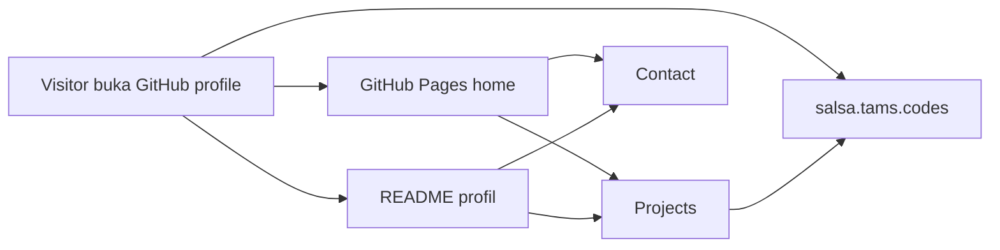
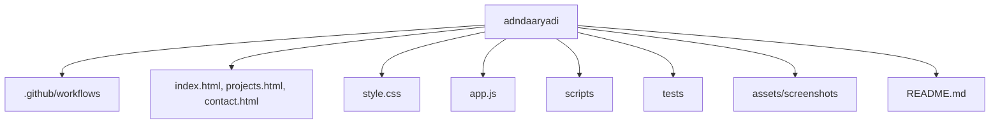
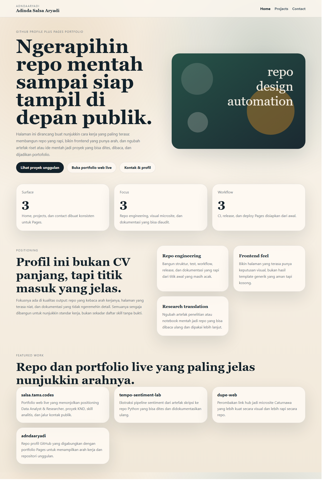
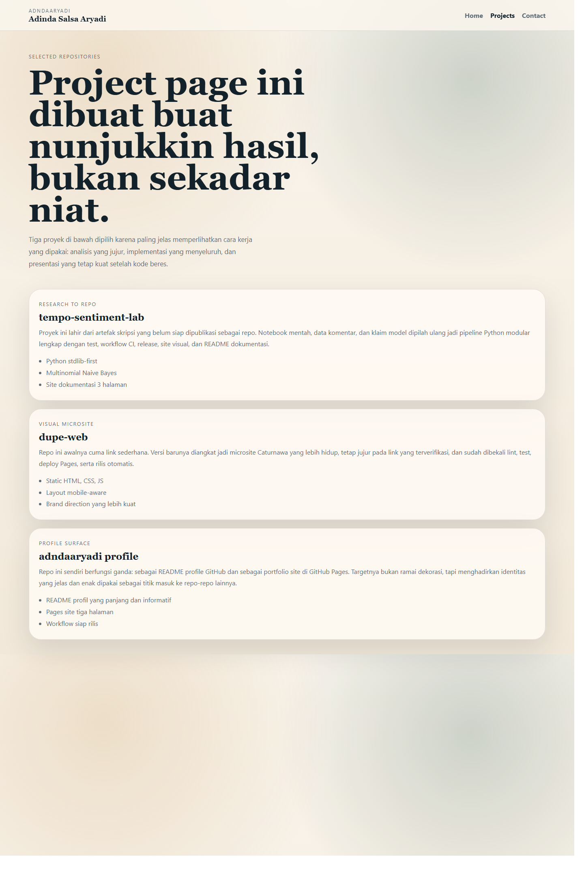
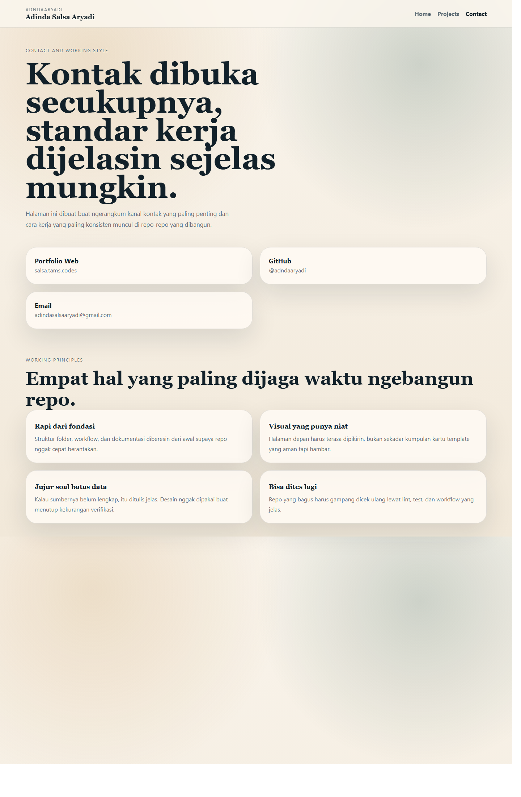
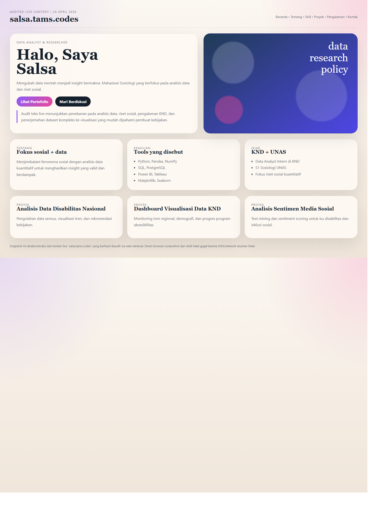

# Adinda Salsa Aryadi


Halo, aku Adinda Salsa Aryadi. Repo ini dibikin sebagai dua permukaan sekaligus: profil GitHub yang tampil langsung di halaman akun, dan portfolio statis yang bisa jalan lewat GitHub Pages. Setelah update ini, repo profile juga secara eksplisit terhubung ke versi web live di [salsa.tams.codes](https://salsa.tams.codes/). Tujuannya bukan sekadar bikin bio yang kelihatan penuh, tapi menghadirkan titik masuk yang jelas ke cara kerja, repo unggulan, gaya implementasi yang paling sering muncul di project-project yang dibangun, dan surface web publik yang sudah tayang. Fokus utamanya ada di repo engineering, frontend statis yang punya rasa, dan dokumentasi yang tidak ngeremehin detail.

Kalau profil GitHub cuma diisi satu paragraf pendek, orang biasanya cuma dapat kesan nama dan avatar. Kalau portfolio pribadi cuma mengejar estetika, orang sering gagal ngerti apa yang benar-benar dikerjakan. Repo ini sengaja ditempatkan di tengah: visualnya tetap niat, tapi semua bagian tetap mengarah ke hal-hal yang bisa dibuktikan. Ada halaman proyek, ada halaman kontak, ada workflow, ada test, ada screenshot, ada integrasi ke portfolio live, dan ada README besar yang menjelaskan semuanya tanpa muter-muter.

## Arah Profil Ini

Profil ini dirancang untuk menggambarkan satu pola kerja yang cukup konsisten:

- ngerapihin repo mentah sampai punya struktur yang kebaca
- bikin halaman yang tampil kuat tanpa jatuh ke template generik
- ngubah notebook, data, atau ide awal jadi project yang lebih siap dipakai publik

Itu sebabnya surface repo ini sengaja dibagi jadi empat:

1. `README.md` untuk profil GitHub dan dokumentasi utama
2. `index.html`, `projects.html`, `contact.html` untuk portfolio Pages
3. `https://salsa.tams.codes/` sebagai portfolio web live yang memperluas surface publik Salsa
4. workflow, lint, test, dan metadata script supaya repo ini sendiri juga jadi bukti standar kerja

## Yang Lagi Ditonjolkan dari Profil Ini

### 1. Repo engineering

Bagian ini penting karena banyak proyek terlihat keren di permukaan, tapi begitu dibuka ternyata tidak punya struktur, tidak punya test, dan tidak punya workflow. Di repo ini, arah yang ingin ditunjukkan justru kebalikannya. Bahkan untuk site profil sekalipun, quality gate tetap disiapkan. Ada lint, ada test Node, ada deploy Pages, ada release otomatis, dan ada script metadata GitHub. Itu menegaskan bahwa repo kecil tetap layak diperlakukan serius.

### 2. Frontend feel

Halaman portfolio di repo ini tidak dibikin seperti dashboard yang penuh kotak-kotak kecil. Fokusnya tetap pada komposisi besar, hierarki yang jelas, dan copy yang langsung. Hero headline dibuat besar karena identitas harus terasa sejak layar pertama. Bidang warna dipakai untuk membangun rasa, bukan cuma dekorasi. Semua itu dibuat dengan HTML, CSS, dan JS statis yang ringan supaya tetap gampang di-maintain.

### 3. Research translation

Profil ini juga menonjolkan kemampuan menerjemahkan artefak mentah menjadi repo yang lebih rapi. Itu kelihatan jelas di proyek `tempo-sentiment-lab`, di mana notebook dan data komentar yang awalnya belum siap dipublikasikan dipecah jadi pipeline Python modular lengkap dengan dokumentasi visual. Buat aku, titik ini penting karena sering kali nilai proyek bukan cuma di hasil akhir, tapi di kemampuan mengubah bahan mentah jadi fondasi yang bisa dipakai lagi.

## Surface yang Disiapkan

| Surface | Fungsi |
| --- | --- |
| `README.md` | tampil langsung di profil GitHub sebagai entry point utama |
| `index.html` | landing page portfolio dengan positioning dan repo unggulan |
| `projects.html` | sorotan proyek dengan konteks masalah, pendekatan, dan output |
| `contact.html` | jalur kontak dan prinsip kerja |
| `salsa.tams.codes` | portfolio web live yang menampilkan positioning Data Analyst & Researcher |

### Diagram Alur Surface



### Diagram Struktur Repo



## Featured Projects

Repo ini sengaja menaruh tiga repo utama plus satu portfolio web live sebagai pusat cerita, karena kombinasi inilah yang paling jelas memperlihatkan arah kerja.

### salsa.tams.codes

Portfolio web live di `salsa.tams.codes` sekarang jadi pasangan langsung dari repo profile ini. Audit konten live tanggal 24 April 2026 menunjukkan bahwa situs tersebut memosisikan Salsa sebagai **Data Analyst & Researcher**, dengan narasi yang kuat di area analisis data, riset sosial, pengalaman di Komisi Nasional Disabilitas, proyek terpilih, jejak akademik, dan kontak publik. Buat repo profile ini, keberadaan `salsa.tams.codes` penting karena memberi permukaan publik yang lebih langsung, sementara repo GitHub tetap berfungsi sebagai dokumen teknis, hub proyek, dan bukti kualitas kerja di belakangnya.

Karena shell lokal saat turn ini mengalami masalah resolver DNS, direct browser capture dari mesin ini gagal. Supaya tetap jujur dan tetap berguna, repo ini sekarang menyimpan **audited visual snapshot** yang direkonstruksi dari konten live yang berhasil diaudit lewat browser web retrieval, bukan pura-pura diklaim sebagai screenshot browser asli. Pendekatan ini sengaja dipilih agar integrasi portfolio live tetap masuk ke repo tanpa mengorbankan akurasi.

### tempo-sentiment-lab

Ini adalah proyek yang mengekstrak bagian machine learning dari artefak skripsi ke repo yang jauh lebih rapi. Di sini, nilai utamanya bukan cuma model yang bisa jalan, tapi prosesnya yang dibuka. Notebook mentah dipecah jadi modul, data mentah dipisahkan, output dibuat reproducible, dan dokumentasi visual ikut dibangun. Buat profil GitHub, proyek seperti ini penting karena nunjukkin bahwa analisis, implementasi, dan dokumentasi bisa jalan bareng.

### dupe-web

Repo ini mewakili sisi frontend dan repo polishing. Titik awalnya sangat sederhana: satu halaman link dengan styling generik. Hasil akhirnya jadi microsite Caturnawa yang punya komposisi lebih kuat, lebih mobile-aware, dan tetap jujur pada link yang memang terverifikasi dari sumber awal. Buat profil ini, `dupe-web` jadi bukti bahwa proyek kecil pun bisa diangkat kualitasnya kalau dikerjakan dengan niat.

### adndaaryadi profile

Repo ini sendiri adalah proyek ketiga. Dia bukan sekadar wadah biodata, tapi contoh bahwa profile repo bisa diperlakukan sebagai produk yang lengkap. Ada surface GitHub profile, ada Pages, ada workflow, ada screenshot, ada script metadata, dan ada README yang tidak pelit konteks. Jadi repo ini bukan cuma menjelaskan project lain, tapi juga menunjukkan caranya.

## Filosofi Kerja yang Mau Ditampilkan

Ada beberapa prinsip yang sengaja dijaga di seluruh repo yang dibangun:

### Jelas dari fondasi

Struktur folder, file inti, test, dan workflow harus terbaca. Kalau orang baru buka repo, dia harus langsung ngerti mana yang penting, mana yang dokumen, mana yang build surface, dan mana yang quality gate.

### Niat di visual, bukan dekorasi kosong

Desain yang kuat bukan soal menambah gradient dan shadow sebanyak mungkin. Yang lebih penting adalah satu ide besar per section, headline yang punya bobot, CTA yang jelas, dan background yang membangun suasana tanpa mengganggu fungsi.

### Jujur soal batas

Kalau data tidak lengkap, itu ditulis. Kalau link belum terverifikasi, jangan dikarang. Kalau model masih baseline, jangan dipoles jadi seolah final. Buat aku, kualitas repo juga ditentukan oleh sejauh mana repo itu bisa dipercaya.

### Bisa dicek ulang

Repo yang sehat harus gampang diuji. Makanya bahkan untuk portfolio dan microsite statis, quality gate tetap dibuat. Ini bukan soal formalitas, tapi soal menjaga supaya perubahan berikutnya tidak gampang merusak fondasi yang sudah jadi.

## Teknologi yang Dipakai di Repo Ini

Walau repo ini terlihat simpel dari luar, pemilihan stack-nya sengaja konservatif:

- HTML statis untuk struktur halaman
- CSS murni untuk layout, komposisi, warna, dan responsivitas
- JavaScript ringan untuk perilaku dasar
- Node bawaan untuk lint dan test tanpa dependency tambahan
- GitHub Actions untuk CI, Pages, dan release
- PowerShell script untuk update metadata repo secara aman lewat `GITHUB_TOKEN`

Pendekatan ini dipilih karena profil repo harus ringan, gampang dipahami, dan tidak butuh setup rumit. Bukan berarti tidak mampu pakai framework, tapi memang tidak perlu. Buat surface seperti ini, stack yang sederhana justru bikin repo lebih tahan lama.

## Statistik dan Ringkasan

### Quick numbers

| Item | Nilai |
| --- | --- |
| Halaman portfolio | 3 |
| Workflow GitHub Actions | 3 |
| Test Node | 2 |
| Script utilitas | 2 |
| Featured repos + live portfolio | 4 |

### Dynamic profile stats


Statistik di atas bukan tujuan utama, tapi tetap berguna sebagai lapisan cepat untuk pembaca yang pengin scan profil tanpa membaca semua bagian. Sisanya dijelaskan lebih dalam di halaman project dan bagian filosofi kerja.

## Screenshot Halaman

### Home



### Projects



### Contact



### Audited Snapshot Portfolio Web Live



Bagian ini sengaja diberi label audited snapshot. Kontennya ditarik dari audit live `salsa.tams.codes` tanggal 24 April 2026, lalu divisualkan ulang secara jujur karena direct screenshot browser dari shell lokal gagal akibat masalah resolver DNS.

## Quality Gate Repo Ini

Repo profile ini sengaja tidak dibiarkan jadi kumpulan file tanpa penjaga. Ada tiga lapisan quality gate yang dipasang:

### Static lint

`scripts/lint.mjs` memeriksa bahwa file inti ada, setiap halaman punya `<!doctype html>`, title, meta description, dan nav. CSS juga harus punya breakpoint responsif. Ini memastikan repo tidak kehilangan dasar-dasar yang kelihatan kecil tapi sebenarnya penting.

### Test Node

`tests/site.test.mjs` memeriksa:

1. seluruh halaman profile punya navigasi silang
2. halaman kontak memuat GitHub dan email yang benar
3. surface repo ini benar-benar menautkan `https://salsa.tams.codes/`

Test-nya memang ringan, tapi pas untuk repo statis seperti ini. Prinsipnya bukan bikin test yang kelihatan canggih, tapi bikin test yang benar-benar ngebantu jaga kualitas.

### Workflow GitHub

- `ci.yml` untuk lint dan test
- `pages.yml` untuk deploy halaman statis ke GitHub Pages
- `release.yml` untuk tag dan latest release otomatis

Ini sengaja dipasang lengkap karena user di task ini minta repo tidak cuma bagus di lokal, tapi juga siap dipakai sebagai repo publik yang serius.

## Metadata Repo GitHub

Supaya update deskripsi dan topik repo tidak dilakukan manual terus-menerus lewat UI, repo ini juga punya `scripts/github_repo_metadata.ps1`. Script ini tidak menyimpan token di source code. Token dibaca dari environment variable `GITHUB_TOKEN`, jadi kredensial tetap aman.

Topik yang disiapkan untuk repo ini:

- `github-profile`
- `portfolio`
- `static-site`
- `github-pages`
- `personal-brand`
- `frontend`

Selain metadata repo GitHub, integrasi ke `salsa.tams.codes` juga sekarang masuk ke konten repo dan surface Pages, jadi pembaca tidak perlu menebak apakah Salsa punya portfolio web live di luar GitHub atau tidak. Jawabannya sekarang jelas dan terlihat langsung.

Contoh dry run:

```powershell
& .\scripts\github_repo_metadata.ps1 -DryRun
```

Dengan cara ini, deskripsi repo, homepage Pages, dan topics bisa dipelihara secara terstruktur.

## Cara Menjalankan Lokal

Kalau mau preview repo ini di lokal:

### Lint

```bash
node scripts/lint.mjs
```

### Test

```bash
node --test tests/*.test.mjs
```

### Preview cepat

Buka langsung:

- `index.html`
- `projects.html`
- `contact.html`

Untuk melihat portfolio web live:

- `https://salsa.tams.codes/`

Atau jalankan server lokal:

```bash
python -m http.server 8080
```

Lalu akses `http://localhost:8080/`.

## Kenapa README Ini Panjang

Banyak profile repo berhenti di satu banner, satu kalimat bio, dan satu list badge. Itu cepat dibaca, tapi tidak memberi konteks apa pun tentang standar kerja, cara berpikir, atau kualitas repo yang diharapkan. README ini sengaja panjang karena mau menjawab pertanyaan yang biasanya tidak terjawab di profile biasa:

- repo seperti apa yang sebenarnya dibangun?
- standar kualitas yang dijaga itu apa?
- frontend yang dikerjakan maunya seperti apa?
- project unggulan apa dan kenapa dipilih?
- versi web live-nya ada di mana dan bagaimana hubungannya dengan repo GitHub?
- kalau orang mau ngontak atau kolaborasi, jalurnya ke mana?

Dengan README yang lebih lengkap, profil ini tidak cuma jadi pajangan, tapi juga dokumen orientasi. Orang yang buka repo ini bisa langsung dapat gambaran yang cukup utuh tanpa harus berpindah-pindah dulu ke banyak tempat.

## Yang Sengaja Tidak Dikejar

Profil ini sengaja tidak dikejar ke arah yang terlalu ramai. Tidak ada slider berlebihan, tidak ada klaim pengalaman yang dilebih-lebihkan, tidak ada daftar skill panjang tanpa bukti, dan tidak ada dekorasi yang bikin pembaca lupa ke inti. Repo ini juga tidak mencoba jadi timeline personal yang menceritakan semuanya dari awal sampai akhir. Yang dipilih justru hal-hal yang paling membantu orang memahami kualitas kerja: repo unggulan, cara berpikir, jalur kontak, dan fondasi teknis yang menjaga surface ini tetap sehat. Buatku, profil yang matang bukan yang paling bising, tapi yang paling jelas menunjukkan apa yang dikerjakan, bagaimana cara kerjanya, dan standar apa yang dijaga ketika hasil akhirnya dipublikasikan.

## Batas yang Tetap Diakui

Walau repo ini sudah jauh lebih proper daripada repo kosong biasa, ada batas yang tetap perlu disebut:

1. profil ini tidak mencoba jadi CV lengkap atau timeline hidup
2. halaman project menonjolkan repo terpilih, bukan katalog semua repositori
3. statistik GitHub yang dipakai memanfaatkan layanan pihak ketiga untuk render gambar
4. repo ini fokus di presentasi dan struktur, jadi tidak semua detail personal sengaja dibuka

Justru karena batas ini ditulis jelas, profil jadi lebih enak diikuti. Pembaca tidak dipaksa mencerna terlalu banyak hal sekaligus, dan repo tetap fokus pada yang paling penting.

## Roadmap Berikutnya

Ada beberapa arah pengembangan yang masuk akal untuk repo ini sesudah semua push GitHub normal lagi:

1. menambah og-image khusus untuk preview link profile
2. menambahkan section update singkat atau changelog visual kalau repo makin sering berubah
3. menghubungkan featured projects ke release badge yang lebih spesifik
4. menambahkan asset SVG custom untuk kartu statistik yang benar-benar satu gaya dengan site
5. kalau nanti perlu, menambah form kontak atau landing proyek tertentu tanpa merusak struktur yang sudah ada

Roadmap ini sengaja dijaga realistis. Intinya bukan menumpuk fitur, tapi memperdalam hal yang sudah kuat.

## Troubleshooting

### Lint gagal: "File wajib hilang"

Pastikan semua file inti ada di root: `index.html`, `projects.html`, `contact.html`, `style.css`, `app.js`.

### Test gagal: navigasi tidak lengkap

Test memverifikasi setiap halaman HTML punya link ke ketiga halaman. Pastikan setiap file HTML punya elemen `<nav>` dengan link ke `./index.html`, `./projects.html`, dan `./contact.html`.

### GitHub Pages tidak tampil

Pastikan workflow `pages.yml` aktif dan branch `main` sudah di-push. Pages deploy dari root directory.

## Kontak

- GitHub: [github.com/adndaaryadi](https://github.com/adndaaryadi)
- Portfolio Web: [salsa.tams.codes](https://salsa.tams.codes/)
- Email: [adindasalsaaryadi@gmail.com](mailto:adindasalsaaryadi@gmail.com)

## Kontributor

| Nama | Peran |
| --- | --- |
| Adinda Salsa Aryadi | Owner profile repo dan identitas GitHub |
| Codex local runtime | Implementasi portfolio site, workflow, screenshot, quality gate, dan README besar |

## Penutup

Repo profile ini dibangun supaya akun GitHub tidak berhenti di halaman kosong atau README pendek yang cepat habis dibaca. Di sini, profil dijadikan titik masuk yang jelas ke repo-repo unggulan, gaya implementasi, dan standar kerja yang dijaga. Frontend-nya sengaja dibuat punya rasa, workflow-nya sengaja dibuat lengkap, dan dokumentasinya sengaja dibuat tebal supaya orang yang mampir bisa langsung ngerti arah kerjanya. Singkatnya: repo ini bukan cuma "tentang aku", tapi juga contoh konkret bagaimana repo diperlakukan dengan serius dari tampilan sampai fondasinya.
